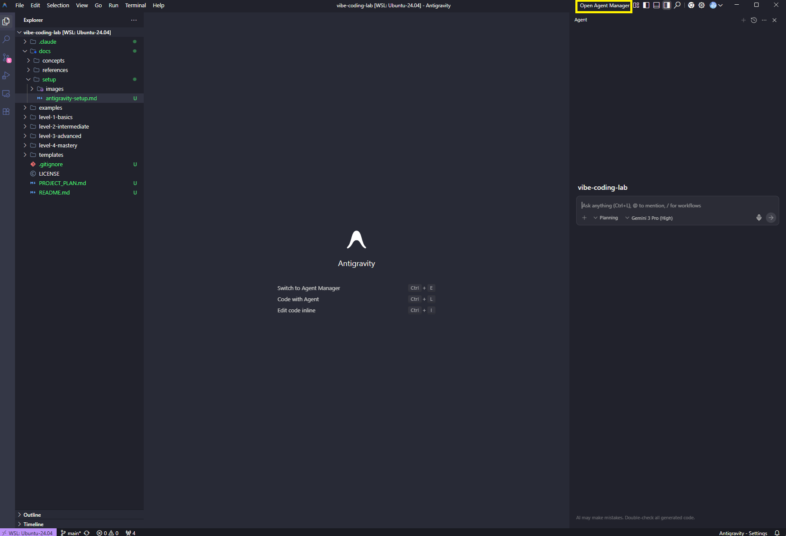
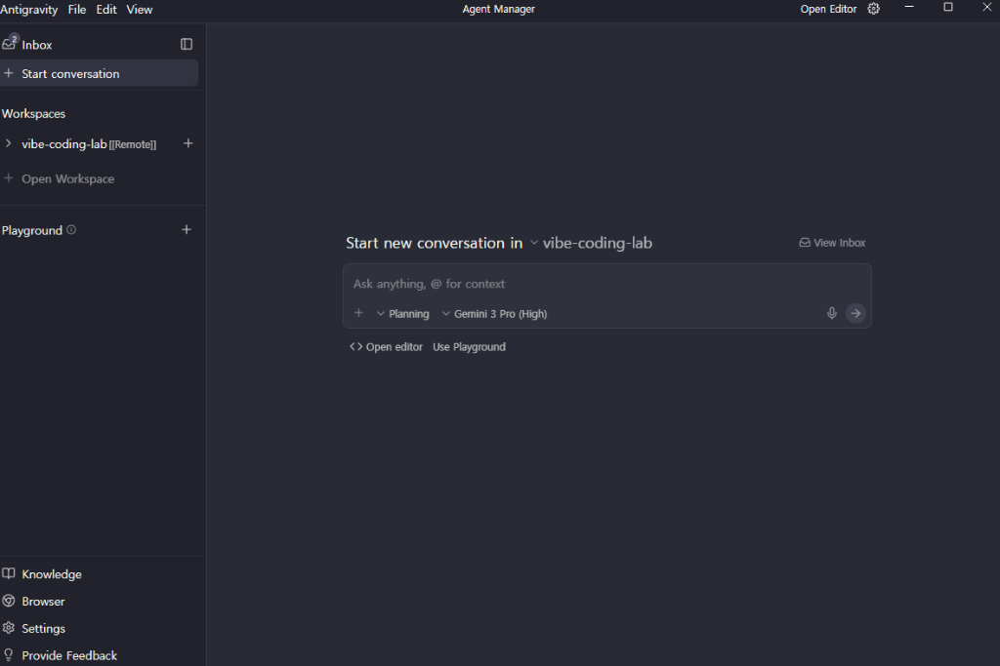
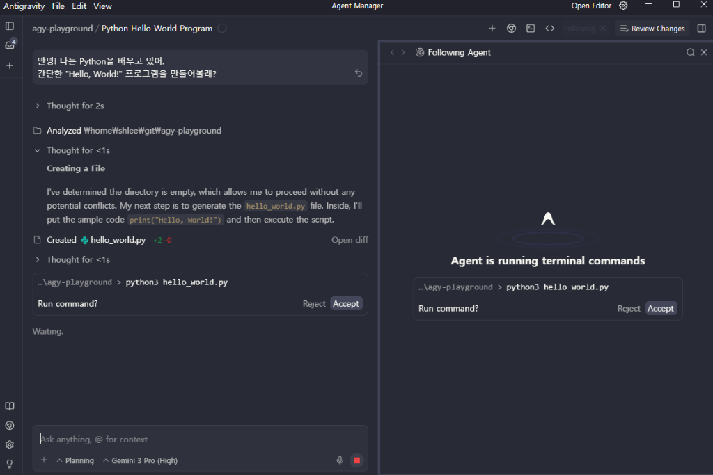

# Google Antigravity 설정 가이드

> Vibe Coding Lab을 시작하기 위한 안티그라비티 설정 방법

## 📋 개요

Google Antigravity는 멀티 AI 에이전트를 활용한 협업 개발 플랫폼입니다. 이 가이드는 Vibe Coding Lab 학습을 위한 기본 설정을 안내합니다.

---

## 🚀 시작하기

### 1. 계정 생성

1. **안티그라비티 웹사이트 접속**
   - 공식 사이트에서 계정을 생성합니다
   - Google 계정으로 로그인 가능

<!-- 📸 TODO: 스크린샷 추가 - antigravity-login.png -->
<!-- 설명: 안티그라비티 로그인 화면 -->

2. **무료 플랜 선택**
   - 학습 목적으로는 무료 플랜으로 충분합니다
   - Gemini 3 Pro 및 Claude Sonnet 4.5 액세스 확인

3. **이메일 인증**
   - 가입 시 받은 이메일로 계정 활성화

---

## ⚙️ 기본 설정

### Agent Manager 설정

#### 1. 첫 번째 에이전트 생성

**Level 1에서는 단일 에이전트만 사용합니다.**

1. 오른 상단 툴바에서 **'Open Agent Manager'** 클릭


<!-- 설명: 우측 상단 툴바에서 Agent Manager 위치 -->

---

## 💬 첫 대화 시작하기

### Inbox 사용하기

1. 좌측 사이드바에서 **'Inbox'** 클릭
2. 새 대화 시작: **'New Conversation'**


<!-- 설명: Inbox에서 새 대화 시작하는 화면 -->

3. 첫 메시지 입력:

```
안녕! 나는 Python을 배우고 있어.
간단한 "Hello, World!" 프로그램을 만들어볼래?
```

4. AI의 응답 확인


<!-- 설명: AI와의 첫 대화 예시 -->

5. 코드를 실행해보고 결과 공유

---

## 🎯 Level 1을 위한 추천 설정

### 단일 에이전트 모드

Level 1에서는 **한 개의 에이전트**만 사용합니다:

**옵션 1: Claude Sonnet 4.5 (추천)** ⭐
- ✅ 코드 품질 우수
- ✅ 논리적 구현 탁월
- ✅ TDD 학습에 적합
- ⚠️ 최신 정보 검색 기능 제한

**옵션 2: Gemini 3 Pro**
- ✅ 구글 생태계 데이터 활용
- ✅ 최신 정보 검색 가능
- ⚠️ 코드 구현이 Claude보다 약간 덜 정교할 수 있음

**추천**: 초심자는 **Claude Sonnet 4.5**로 시작
- 더 깔끔하고 버그 없는 코드
- TDD 학습에 최적

---

## 🔧 환경 설정 (선택사항)

### 프로젝트 연결

안티그라비티를 로컬 환경과 연결할 수 있습니다 (선택):

1. **안티그라비티 CLI 설치**
   ```bash
   # 설치 방법은 공식 문서 참고
   # (실제 설치 방법은 안티그라비티 플랫폼에 따라 다름)
   ```

2. **프로젝트 초기화**
   ```bash
   cd vibe-coding-lab
   # 초기화 명령 실행
   ```

> **참고**: CLI는 선택사항입니다. 웹 인터페이스만으로도 모든 학습이 가능합니다.

---

## ✅ 설정 확인 체크리스트

설정이 완료되었는지 확인하세요:

- [ ] 안티그라비티 계정 생성 완료
- [ ] 이메일 인증 완료
- [ ] Agent Manager에서 첫 에이전트 생성
- [ ] 에이전트 활성화 (ON 상태)
- [ ] Inbox에서 첫 대화 성공
- [ ] "Hello, World!" 코드 생성 확인

✅ 모든 항목이 체크되었다면, 이제 [Level 1 시작하기](../../level-1-basics/README.md)로 이동하세요!

---

## 🆘 문제 해결

설정 중 문제가 발생했나요?

- [문제 해결 가이드](./troubleshooting.md) 참고
- [FAQ](../references/faq.md) 확인
- [GitHub Issues](https://github.com/arch-shlee/vibe-coding-lab/issues)에 질문하기

---

## 🔗 다음 단계

1. [개발 환경 설정](./environment.md) - Python 로컬 환경 구성
2. [Level 1 시작하기](../../level-1-basics/README.md)
3. [바이브코딩 개념 이해하기](../concepts/vibe-coding.md)

---

## 📸 이미지 가이드

**이 문서에 필요한 스크린샷 목록:**

| 파일명 | 설명 | 위치 |
|--------|------|------|
| `antigravity-login.png` | 로그인 화면 | 계정 생성 섹션 |
| `agent-manager-sidebar.png` | Agent Manager 메뉴 | 기본 설정 섹션 |
| `new-agent-button.png` | New Agent 버튼 | 에이전트 생성 섹션 |
| `agent-creation-form.png` | 에이전트 생성 폼 | 에이전트 생성 섹션 |
| `agent-activated.png` | 활성화된 에이전트 | 에이전트 활성화 섹션 |
| `inbox-new-conversation.png` | 새 대화 시작 | 첫 대화 섹션 |
| `first-conversation.png` | AI 응답 예시 | 첫 대화 섹션 |

**이미지 저장 경로**: `docs/setup/images/`

---

**작성일**: 2026-01-13
**작성자**: arch-shlee & Claude (협업)
**상태**: 초안 (이미지 추가 필요)
