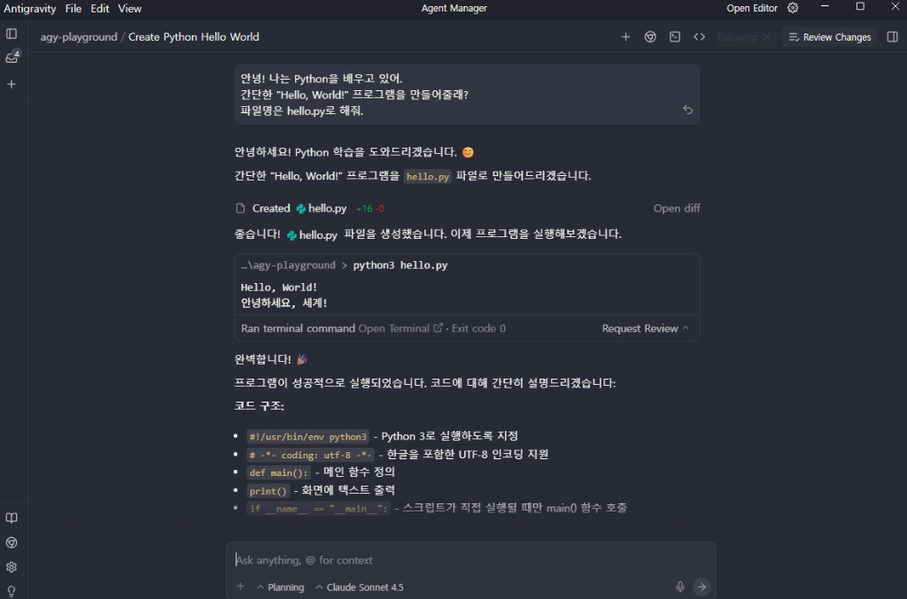
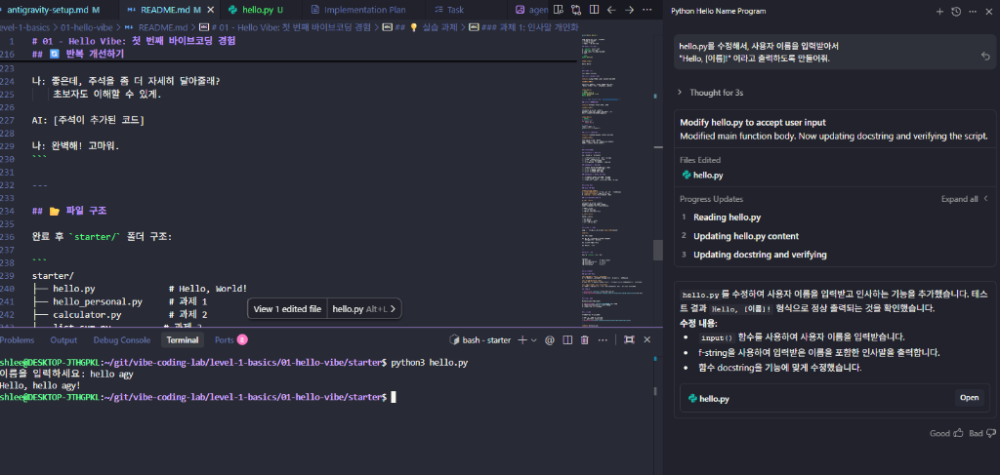

# 01 - Hello Vibe: 첫 번째 바이브코딩 경험

> AI와 대화하며 첫 Python 프로그램을 만들어봅니다.

## 🎯 학습 목표

- 바이브코딩이 무엇인지 직접 체험하기
- AI와 자연스럽게 대화하며 코드 작성하기
- "의도(Vibe)"만 전달하여 결과물 얻기
- AI 응답을 검증하고 개선하는 방법 배우기

**예상 소요 시간**: 2-3시간

---

## 📚 학습 내용

### 바이브코딩이란?

**바이브코딩(Vibe Coding)**은 개발자가 "무엇을 만들고 싶은지"만 전달(vibe)하면, AI가 코드를 생성하고, 개발자는 방향을 조율하는 개발 방식입니다.

**전통적 코딩**:
```
개발자가 모든 코드를 직접 작성 → 디버깅 → 완성
```

**바이브코딩**:
```
개발자: 의도 전달 → AI: 코드 생성 → 개발자: 검증 및 조율 → 완성
```

### 핵심 원칙

1. **개발자는 선장, AI는 부사수**
   - 방향은 개발자가 결정
   - 실행은 AI가 지원

2. **의도를 명확하게 전달**
   - 무엇을 만들고 싶은지
   - 어떻게 작동해야 하는지

3. **결과물을 항상 검증**
   - AI가 만든 코드 실행해보기
   - 예상대로 작동하는지 확인

---

## 🚀 실습: Hello, World!

### Step 1: 안티그라비티 준비

1. 안티그라비티 웹 인터페이스 접속
2. 에이전트 확인 (Claude Sonnet 4.5 또는 Gemini 3 Pro)
3. 새 대화 시작

### Step 2: 첫 바이브 전달

안티그라비티 Inbox에 다음과 같이 입력:

```
안녕! 나는 Python을 배우고 있어.
간단한 "Hello, World!" 프로그램을 만들어줄래?
파일명은 hello.py로 해줘.
```


<!-- 설명: AI에게 첫 요청을 보내는 화면 -->

### Step 3: AI 응답 이해하기

AI는 다음과 같은 코드를 생성할 것입니다:

```python
# hello.py
print("Hello, World!")
```

AI가 설명도 함께 제공할 것입니다:
- 코드가 무엇을 하는지
- 어떻게 실행하는지
- 추가로 할 수 있는 것들

### Step 4: 코드 실행

1. `starter/` 폴더로 이동
2. `hello.py` 파일 생성
3. AI가 제공한 코드 복사-붙여넣기
4. 실행:

```bash
python hello.py
```

**예상 출력**:
```
Hello, World!
```

---

## 💡 실습 과제

이제 스스로 해보세요!

### 과제 1: 인사말 개인화

**목표**: 사용자 이름을 받아서 인사하는 프로그램

**AI에게 요청**:
```
hello.py를 수정해서, 사용자 이름을 입력받아서
"Hello, [이름]!" 이라고 출력하도록 만들어줘.
```

**예상 결과**:
```bash
$ python hello.py
이름을 입력하세요: Alice
Hello, Alice!
```



### 과제 2: 계산기 함수

**목표**: 두 숫자를 더하는 함수 만들기

**AI에게 요청**:
```
calculator.py 파일을 만들어줘.
두 숫자를 입력받아서 더하는 add 함수를 만들고,
결과를 출력하는 프로그램을 작성해줘.
```

**예상 결과**:
```python
# calculator.py
def add(a, b):
    return a + b

# 테스트
result = add(3, 5)
print(f"3 + 5 = {result}")
```

### 과제 3: 리스트 처리

**목표**: 리스트의 숫자들을 합산하는 프로그램

**AI에게 요청**:
```
list_sum.py 파일을 만들어줘.
숫자 리스트를 받아서 모든 숫자의 합을 반환하는
함수를 만들어줘. 예시도 포함해서.
```

---

## 📝 체크포인트

### Checkpoint 1: 기본 이해

다음 질문에 답할 수 있나요?

- [ ] 바이브코딩이 무엇인지 설명할 수 있다
- [ ] AI와 대화하며 코드를 받았다
- [ ] 받은 코드를 실행해봤다
- [ ] 코드가 예상대로 작동하는지 확인했다

### Checkpoint 2: 실습 완료

- [ ] Hello, World! 프로그램 작성 및 실행
- [ ] 과제 1 (인사말 개인화) 완료
- [ ] 과제 2 (계산기 함수) 완료
- [ ] 과제 3 (리스트 처리) 완료

### Checkpoint 3: 바이브 전달 능력

- [ ] 명확하게 원하는 것을 요청할 수 있다
- [ ] AI의 응답을 이해하고 적용할 수 있다
- [ ] 결과물이 만족스럽지 않으면 다시 요청할 수 있다

---

## 🎓 학습 정리

### 핵심 개념 복습

**바이브코딩의 3단계**:
1. **Vibe (의도 전달)**: 무엇을 만들고 싶은지 명확히 전달
2. **Generate (생성)**: AI가 코드를 생성
3. **Verify (검증)**: 코드를 실행하고 확인

### 효과적인 바이브 전달 팁

✅ **좋은 예시**:
```
calculator.py 파일을 만들어줘.
두 숫자를 더하는 add 함수를 작성하고,
함수를 테스트하는 예시 코드도 포함해줘.
```
- 명확한 파일명
- 구체적인 기능 설명
- 추가 요구사항 (예시 코드)

❌ **나쁜 예시**:
```
계산기 만들어줘.
```
- 너무 모호함
- 어떤 기능인지 불명확
- 파일 구조 언급 없음

---

## 🔄 반복 개선하기

AI가 만든 코드가 마음에 안 들면 **다시 요청**하세요!

**예시**:
```
AI: [코드 생성]

나: 좋은데, 주석을 좀 더 자세히 달아줄래?
    초보자도 이해할 수 있게.

AI: [주석이 추가된 코드]

나: 완벽해! 고마워.
```

---

## 📂 파일 구조

완료 후 `starter/` 폴더 구조:

```
starter/
├── hello.py              # Hello, World!
├── hello_personal.py     # 과제 1
├── calculator.py         # 과제 2
└── list_sum.py          # 과제 3
```

---

## 🆘 막혔나요?

### 자주 하는 질문

**Q: AI가 복잡한 코드를 만들었어요**
A: "더 간단하게 만들어줄래? 초보자도 이해할 수 있게"라고 요청하세요.

**Q: 코드가 실행이 안 돼요**
A: 오류 메시지를 복사해서 AI에게 보여주고 "이 오류를 어떻게 해결하나요?"라고 물어보세요.

**Q: AI가 내 의도를 잘못 이해했어요**
A: "아니야, 내가 원한 건..." 하고 다시 설명하세요. AI는 대화를 통해 이해합니다.

### 추가 도움

- [solution/](./solution/) 폴더의 모범 답안 참고
- [GitHub Discussions](https://github.com/arch-shlee/vibe-coding-lab/discussions)에 질문

---

## 🔗 다음 단계

01-hello-vibe를 완료했다면:

1. [02-first-tdd](../02-first-tdd/README.md)로 이동
2. TDD의 Red-Green-Refactor 사이클 배우기
3. 테스트 주도 개발 경험하기

---

## 💬 피드백

이 모듈이 도움이 되었나요?

- 어려웠던 부분을 공유해주세요
- 개선 아이디어를 제안해주세요
- [GitHub Issues](https://github.com/arch-shlee/vibe-coding-lab/issues)

---

**모듈**: 01-hello-vibe
**레벨**: Level 1 (기초)
**난이도**: ⭐☆☆☆☆
**예상 시간**: 2-3시간
**작성일**: 2026-01-13
